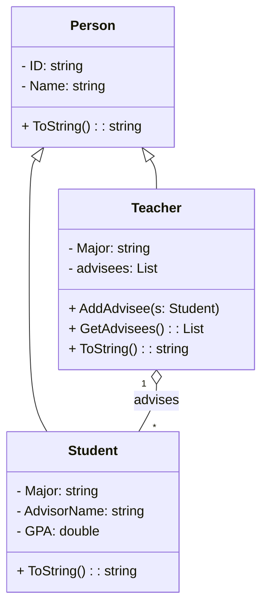

## QUIZ

README - Student Info Program

ข้อมูลผู้พัฒนา

ชื่อ: นนทิวรรธน์ นนท์คำจันทร์

รหัสนักศึกษา: 673450196-2

Class Diagram ของโปรแกรม

หลักการเขียนโปรแกรมเชิงวัตถุ (OOP) ที่ใช้

## 1. Encapsulation (การห่อหุ้มข้อมูล)

คลาส Person, Student, และ Teacher ใช้ Properties (ID, Name, Major, GPA, AdvisorName) ซึ่งช่วยควบคุมการเข้าถึงข้อมูล

ใช้ private List<Student> advisees ใน Teacher เพื่อเก็บข้อมูลนักศึกษาที่อยู่ในการดูแล

## 2. Inheritance (การสืบทอดคุณสมบัติ)

คลาส Student และ Teacher สืบทอด (inherit) จาก Person

ช่วยลดความซ้ำซ้อนของโค้ด เพราะ ID และ Name ถูกกำหนดใน Person แล้ว

## 3. Polymorphism (พหุนิยม)

เมธอด ToString() ถูก Override ใน Student และ Teacher เพื่อให้แสดงผลข้อมูลที่แตกต่างกัน

การใช้งาน List<Person> สามารถเก็บ Student และ Teacher ได้โดยใช้ Polymorphism

## 4. Association (ความสัมพันธ์ระหว่างคลาส)

Teacher มีความสัมพันธ์กับ Student แบบ One-to-Many (1**:N****)** โดยใช้ List<Student>

แสดงเป็น Association ใน Class Diagram (Teacher "1" o-- "*" Student)

สรุป

โปรแกรมนี้ใช้แนวคิด OOP อย่างครบถ้วน ทั้ง Encapsulation, Inheritance, Polymorphism และ Association ซึ่งช่วยให้โค้ดมีความเป็นระเบียบ ดูแลง่าย และสามารถขยายฟังก์ชันเพิ่มเติมได้ในอนาคต

