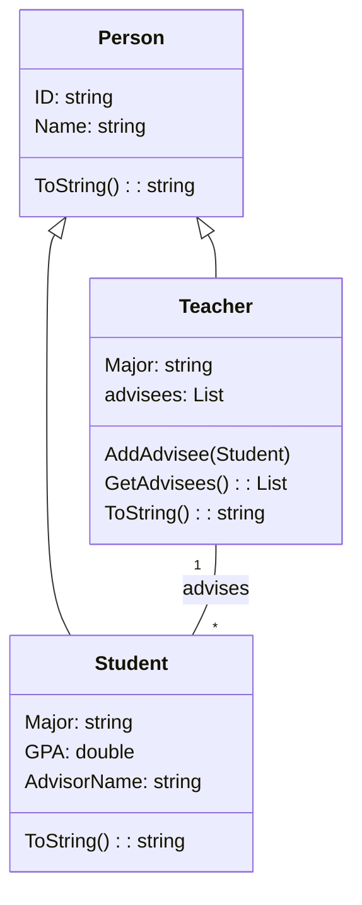

ข้อมูลส่วนตัว

ชื่อ: นนทิวรรธน์ นนท์คำจันทร์
รหัสนักศึกษา: 673450196-2

# 1. Class Diagram

# 2. การใช้หลักการเขียนโปรแกรมเชิงวัตถุ (OOP)

## 1. Encapsulation (การห่อหุ้มข้อมูล)

ใช้ private และ public กำหนดขอบเขตการเข้าถึงข้อมูล เช่น advisees ใน Teacher ถูกกำหนดเป็น private

ใช้ public properties (get; set;) เพื่อควบคุมการเข้าถึงค่าภายในคลาส เช่น ID, Name, Major, GPA

## 2. Inheritance (การสืบทอดคุณสมบัติ)

คลาส Student และ Teacher สืบทอดจาก Person ทำให้ใช้คุณสมบัติของ Person ได้ เช่น ID และ Name

ใช้ override กับเมทอด ToString() เพื่อกำหนดการแสดงผลของแต่ละคลาส

## 3. Polymorphism (พหุสัณฐาน)

ใช้ abstract class Person และ abstract override string ToString() ทำให้คลาสลูก (Student และ Teacher) ต้องกำหนด ToString() ของตนเอง

สามารถใช้งาน Person ผ่าน Student และ Teacher ได้โดยไม่ต้องรู้โครงสร้างภายในของคลาสลูก

## 4. Abstraction (นามธรรม)

ใช้ abstract class Person เพื่อกำหนดโครงสร้างพื้นฐานให้ Student และ Teacher

ทำให้คลาส Person ไม่สามารถถูกสร้างเป็น object ได้โดยตรง แต่ต้องสืบทอดไปใช้ในคลาสลูก

# 3. สรุป

โปรแกรมนี้ถูกออกแบบให้เป็นไปตามหลักการเขียนโปรแกรมเชิงวัตถุ (OOP) โดยใช้ Encapsulation, Inheritance, Polymorphism และ Abstraction เพื่อให้โค้ดมีโครงสร้างที่ดี เข้าใจง่าย และสามารถขยายต่อไปได้อย่างยืดหยุ่นในอนาคต

